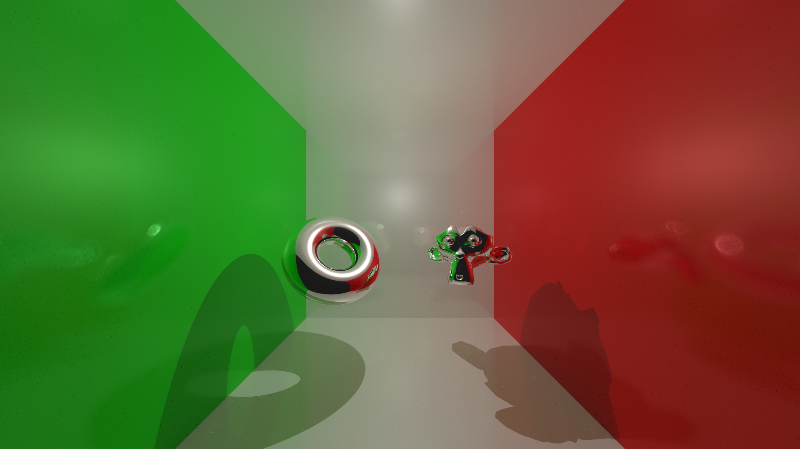
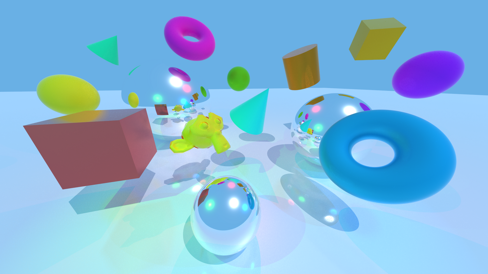

# Radiance 


Radiance is a from-scratch physically-based ray tracing engine with an integrated real-time OpenGL scene editor, built in modern C++ (C++17).

Originally started as a deep dive into graphics programming to understand how modern 3D engines work under the hood, the project evolved into my engineering thesis. It focuses on rendering architecture, acceleration structures, multithreaded systems, and editor tooling.

---

## Example Renders




## Demo

<video src="readme/demo.mp4"
       controls
       style="width: 100%; max-width: 100%;">
</video>

---

## Features

### Ray Tracing Engine
- Physically-based materials (diffuse, metal)
- Multithreaded CPU rendering
- Recursive reflections, soft shadows, anti-aliasing
- SDF primitives and triangle meshes (glTF)
- Median-split BVH with AABB traversal

### Real-Time Editor
- OpenGL viewport with ImGui interface
- Scene graph and entity system
- Transform gizmos (translate / rotate / scale)
- Mesh import and GPU object selection

## Requirements
- CMake ≥ 3.15  
- A C++17-compatible compiler (Clang, GCC, or MSVC)  
- OpenGL 3.3+ capable GPU  

## Build Instructions

Clone the repository and run the build script:

```bash
git clone https://github.com/cdOut/raytracing-thesis.git
cd raytracing-thesis
./build.sh
```